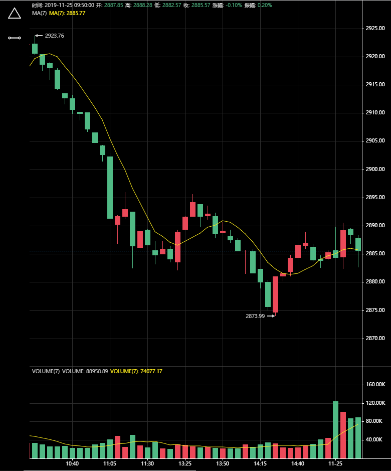

###  KLinek线解决方案

### 注意，本项目只是实验性项目

### 不可用于生产环境
### 不可用于生产环境
### 不可用于生产环境


### 目前已知问题
`
工具在高分辨率的情况下，位置不准确的问题
`


### 功能
-   [x] 缩放
-   [x] 移动
-   [x] 大小变化
-   [x] 多语言
-   [x] 主题（比较分散，主要是设置conf，现阶段比较分散）
-   [x] 工具(只完成部分，删除等还未实现)
-   [x] 指标(只完成部分)
-   [x] 图表高度拖拽
-   [ ] N多细节没有处理（如果以后工作中有k线的必要，会优化这个项目...）


### 预览图

  


下载依赖项
```
npm i
```

开发环境
```
npm run dev
```


生产环境
```
npm run build
```

